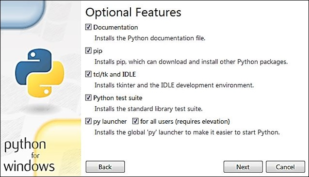
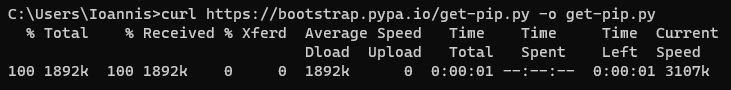
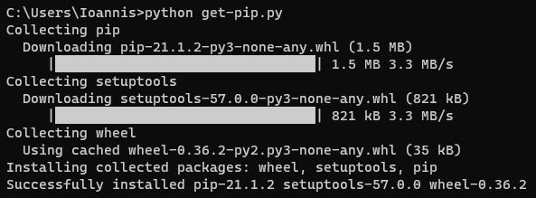
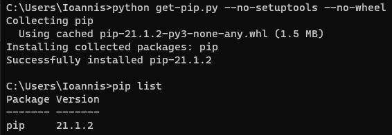

# PyPI

## Installation

### Do I need to install pip?

**pip** is already installed if you are using Python 2 >=2.7.9 or Python 3 >=3.4 downloaded from [python.org](https://www.python.org/) or if you are working in a [Virtual Environment](https://packaging.python.org/tutorials/installing-packages/#creating-and-using-virtual-environments) created by [virtualenv](https://packaging.python.org/key_projects/#virtualenv) or [pyvenv](https://packaging.python.org/key_projects/#venv). Just make sure to [upgrade pip](https://pip.pypa.io/en/stable/installing/#upgrading-pip).



### Installing with get-pip.py

To install pip, securely download [get-pip.py](https://bootstrap.pypa.io/get-pip.py) by following this link: get-pip.py. Alternatively, use `curl`:

```none
curl https://bootstrap.pypa.io/get-pip.py -o get-pip.py
```



Then run the following command in the folder where you have downloaded *get-pip.py*:

```none
python get-pip.py
```



### get-pip.py options

-	If set, do not attempt to install [setuptools](https://packaging.python.org/key_projects/#setuptools) (--no-setuptools)
-	If set, do not attempt to install [wheel](https://packaging.python.org/key_projects/#wheel) (--no-wheel)



## What is the easiest way to remove all packages installed by pip?

```none
pip freeze > requirements.txt
```

Now to remove one by one

```none
pip uninstall -r requirements.txt
```

If we want to remove all at once then

```none
pip uninstall -r requirements.txt -y
```

## [pip - The Python Package Installer](https://pip.pypa.io/en/stable/)

Install a package from PyPI:

```none
pip install SomePackage
```

Install a package from PyPI if the target machine doesn't have a network connection:

```none
pip install SomePackage-1.0-py2.py3-none-any.whl
```

Show what files were installed:

```none
pip show --files SomePackage
```

List what packages are outdated:

```none
pip list --outdated
```

Upgrade a package:

```none
pip install --upgrade SomePackage
```

Uninstall a package:

```none
pip uninstall SomePackage
```
