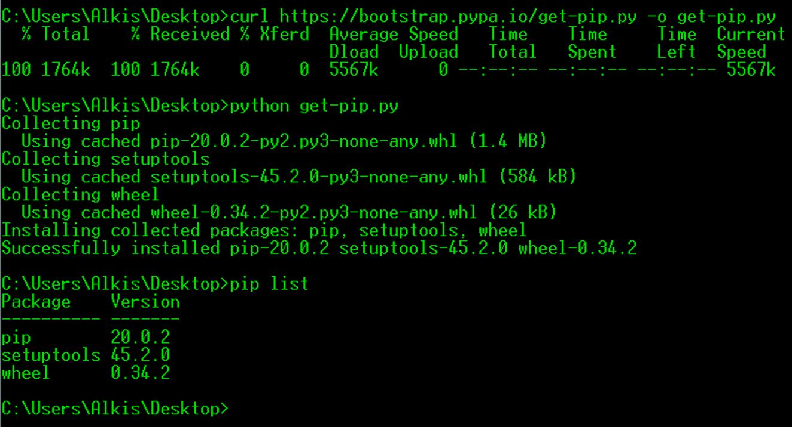
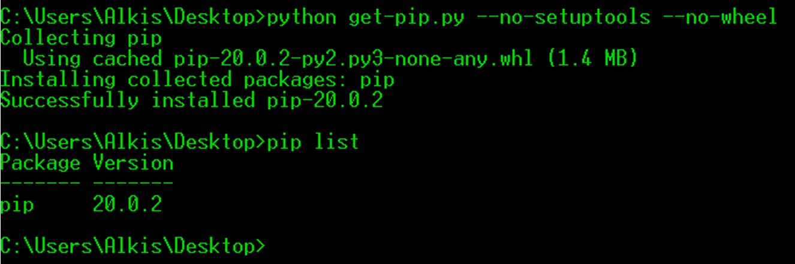

# PyPI

## Installation

### Do I need to install pip?

**pip** is already installed if you are using Python 2 >=2.7.9 or Python 3 >=3.4 downloaded from [python.org](https://www.python.org/) or if you are working in a [Virtual Environment](https://packaging.python.org/tutorials/installing-packages/#creating-and-using-virtual-environments) created by [virtualenv](https://packaging.python.org/key_projects/#virtualenv) or [pyvenv](https://packaging.python.org/key_projects/#venv). Just make sure to [upgrade pip](https://pip.pypa.io/en/stable/installing/#upgrading-pip).


### Installing with get-pip.py

To install pip, securely download [get-pip.py](https://bootstrap.pypa.io/get-pip.py) by following this link: get-pip.py. Alternatively, use `curl`:

```none
curl https://bootstrap.pypa.io/get-pip.py -o get-pip.py
```

Then run the following command in the folder where you have downloaded *get-pip.py*:

```none
python get-pip.py
```



### get-pip.py options

-	If set, do not attempt to install [setuptools](https://packaging.python.org/key_projects/#setuptools) (--no-setuptools)
-	If set, do not attempt to install [wheel](https://packaging.python.org/key_projects/#wheel) (--no-wheel)


