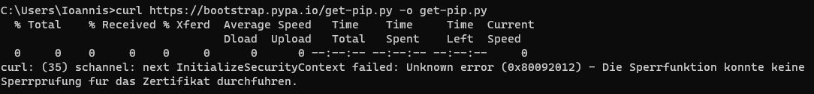

# SSL certificate problem (curl command)



**Solution**: Turn off the Antivirus.

# ModuleNotFoundError

If you try to install SomePackage from PyPI and you get this error:

```none
ModuleNotFoundError: No module named “pkg_resources” 
```

Then try to run

```
pip install -–force-reinstall -U setuptools
```

And now try again to install the *SomePackage* from PyPI.

# Curl command not found on Windows 7 

If you try to install pip use curl and you get an error, then first try to install `curl` on Windows. 

## Windows 10, version 1803 or later 

If you have version 1803 or later of Windows 10, cURL is installed by default. To try it out, see [Testing your cURL installation](https://develop.zendesk.com/hc/en-us/articles/360001068567-Installing-and-using-cURL#test) below.

## Windows

If you have a version of Windows earlier than Windows 10, version 1803, you can download and install cURL as follows.

- In Windows, create a new folder called curl in your C: drive. 
- Go to http://curl.haxx.se/download.html and download one of the zip files. 
- Unzip the downloaded file and move the curl.exe file to your C:\curl folder. 
- Go to http://curl.haxx.se/docs/caextract.html and download the digital certificate file named cacert.pem. 
- Move the cacert.pem file to your C:\curl folder and rename it curl-ca-bundle.crt. 
- Add the curl folder path to your Windows PATH environment variable so that the curl command is available from any location at the command prompt. Update the variable as follows:
  - In the Start menu, right-click This PC and select More > Properties. In Windows 7, right-click Computer and select Properties.
  - Click Advanced System Settings.
  - In the Advanced tab, click the Environment Variables button on the lower right side.
  - Select the "Path" variable in System Variables and click Edit. In the Edit environment variable dialog box, click New and add the path to the curl.exe file. Example: C:\curl. Windows 7: In the Variable Value textbox, append a semicolon to the value, followed by the path to the curl.exe file. Example: ;C:\curl.
