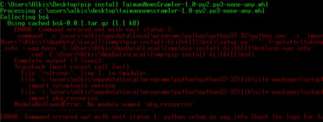
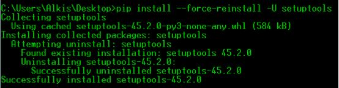
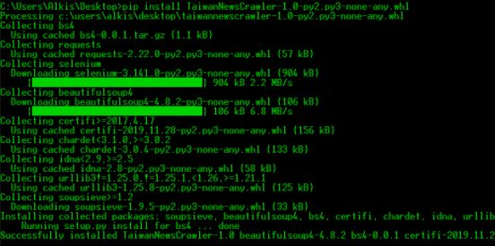

# SSL certificate problem (curl command)


The problem was my Kaspersky antivirus! 

# ModuleNotFoundError

If you try to install SomePackage from PyPI and you get this error:



ModuleNotFoundError: No module named “pkg_resources” 

```
pip install -–force-reinstall -U setuptools
```



And now try again to install the SomePackage from PyPI.


